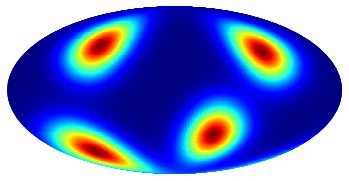
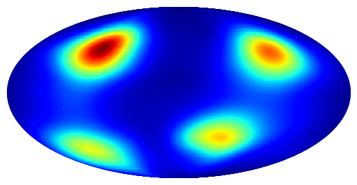
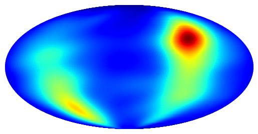

# Overview
This is a Pytorch implementation of [Normalizing Flows on Tori and Spheres](https://arxiv.org/abs/2002.02428) by Rezende et al. All 3 flows on spheres MS, EMP, and EMSRE are implemented, and the Table.1 results have been reproduced. 

This is another great and helpful [JAX attempt](https://github.com/katalinic/sdflows) I refered though the experiment of (N=24, K=1) fails in their case.

# Experiments

We conduct the experiments reported in the Table.1 in the paper, and compare results below (theirs/ours):

## Quantitative

| Model                       | KL          | ESS       |
| --------------------------- | ----------- | --------- |
| MS  | 0.05 / 0.03 | 90% / 96% |
| EMP                | 0.50 / 0.59 | 43% / 42% |
| EMSRE        | 0.82 / 0.81 | 42% / 48% |
| EMSRE         | 0.19 / 0.19 | 75% / 82% |
| EMSRE        | 0.10 / 0.16 | 85% / 84% |

## Qualitative
|  Tagrgt Density   |   Approximated Density by MS  |  Approximated Density by EMSRE   |  Approximated Density by EMP    |
| --- | --- | --- | --- |
|     |     |     |     |

# Run

```bash
pip install -r requirements.txt

# run MS
python MS.py --N 1 --Km 12 --Ks 32
# run EMSRE
python EMSRE --N 24 --K 1
# run EMP
python EMP.py --N 1
```

# Some derivations

1. The gradient of spline transforms: check the paper [Neural Spline Flows](https://proceedings.neurips.cc/paper/2019/hash/7ac71d433f282034e088473244df8c02-Abstract.html)

2. The gradient of mobius transforms :

Note that we only want the determinant of the gradient . 
As the mobius transform  maps a point in a circle into another point in the circle, 
we can have: 

<center>

</center>
